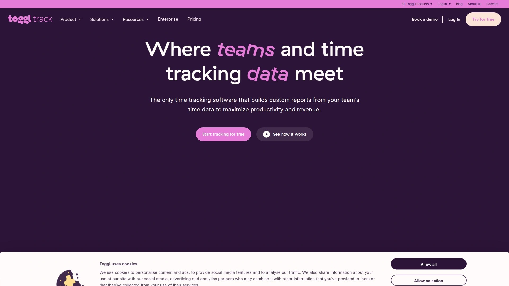

# 2025's Top 10 Best Workforce Analytics Tools

Managing remote teams without clear visibility into work patterns feels like flying blind. You're left guessing who's overloaded, where bottlenecks form, and whether projects are actually moving forward. Workforce analytics software solves this by capturing real-time activity data, tracking productivity patterns, and revealing how time gets spent across your organization. This guide walks through ten platforms that help you understand your team's work habits, optimize resource allocation, and make smarter decisions about capacity and performance.

***

## **[Insightful](https://insightful.io)**

Complete workforce intelligence platform combining real-time monitoring with burnout prevention analytics.

Insightful runs on enterprise-grade infrastructure with built-in security certifications including HIPAA, SOC 2, ISO 27001, and GDPR compliance. The platform tracks computer activity across hybrid, remote, and in-office teams without disrupting workflow, capturing apps, websites, and active work periods automatically. Real-time dashboards show exactly what each team member is working on at any moment, helping managers identify bottlenecks before they derail projects.

The system offers flexible deployment options—cloud-based for quick setup or on-premise for organizations with strict data control requirements. Installation happens through lightweight desktop apps that run quietly in the background, with mass deployment available via Active Directory or Windows RDP for larger organizations. Personal device monitoring requires explicit clock-in/clock-out actions, maintaining privacy boundaries while still capturing work hours.

Location insights compare productivity patterns between office and remote workers, helping companies design work arrangements that actually boost output. The technology usage categorization labels websites and apps as productive or unproductive based on your business needs, giving you accurate productivity percentages instead of just time logged. Screen monitoring provides proof of work through periodic captures, with customizable frequency settings.

The burnout detection feature analyzes work patterns over time, flagging employees showing signs of overwork before health issues emerge. Custom KPIs let you measure what matters to your specific operation rather than generic metrics. Integration capabilities span over 50 tools including Jira, Asana, Workday, Zendesk, and major project management platforms. Pricing starts at $6.40 per user monthly, with volume discounts and annual billing options reducing costs further.

***

## **[Time Doctor](https://www.timedoctor.com)**

Distraction management specialist with video screen capture and comprehensive payroll integration.

Time Doctor emphasizes accountability through detailed activity logging that goes beyond basic time tracking. The platform captures screenshots at random intervals, creating a visual record of work sessions that helps remote managers verify task completion. Video screen recording takes this further by creating continuous recordings of work periods, though this feature lives in higher-tier plans.

Website and app monitoring categorizes activities as productive or unproductive based on customizable rules. If someone spends 20 minutes on social media during work hours, the system logs it and can send alerts to both the employee and manager. This real-time notification system helps redirect focus before entire afternoons vanish into distractions. The idle time detection pauses tracking when keyboard and mouse activity stops, ensuring you only pay for actual work time.

Payroll automation connects tracked hours directly to payment processing, calculating earnings based on hourly rates or project budgets. The system supports payments through multiple processors and generates detailed reports for accounting teams. Client login access lets you give stakeholders visibility into project hours without exposing full team data. Over 60 integrations connect Time Doctor to tools like Slack, Trello, GitHub, and Salesforce.

The Basic plan starts at $6.70 per user monthly, covering time tracking, web usage monitoring, and unlimited screenshots. Standard jumps to $11.70 and adds integrations plus payroll features. Premium hits $16.70 with VIP support, client access, and video captures. Enterprise pricing requires custom quotes but includes SSO and dedicated account management.

***

## **[Hubstaff](https://hubstaff.com)**

GPS-enabled tracking solution built for field teams and distributed workforces with invoicing automation.

Hubstaff combines traditional desk monitoring with location tracking, making it ideal for businesses managing both office workers and field personnel. GPS tracking logs routes, captures location timestamps, and creates geofence boundaries that trigger automatic clock-ins when employees arrive at job sites. This eliminates timesheet fraud and provides proof of service delivery for client-facing work.

The activity monitoring uses mouse and keyboard events to calculate activity percentages, taking screenshots at set intervals to verify work. Fleet tracking adds vehicle monitoring for companies managing delivery drivers or service technicians. Timesheet approvals create review workflows where managers validate hours before they hit payroll systems.

Project budgeting tools let you set hour or dollar limits on initiatives, with automatic alerts when teams approach thresholds. This prevents cost overruns on fixed-price contracts. The payments module processes payroll through PayPal, Wise, Bitwage, and other platforms, supporting international contractors in multiple currencies. Invoice generation pulls tracked hours directly into billable documents, reducing administrative overhead.

The free tier covers one user with basic time tracking. Starter costs $4.99 per user monthly and adds activity tracking with screenshots. Grow hits $7.99 with GPS, budgets, and payroll features. Team level ($10) unlocks unlimited integrations and fleet management. Enterprise requires custom pricing but includes SSO, VIP support, and compliance features.

***

## **[Teramind](https://www.teramind.co)**

Security-first platform emphasizing insider threat detection and data loss prevention capabilities.

Teramind approaches workforce analytics through a security lens, focusing on detecting risky behavior before it causes damage. The data loss prevention module monitors file transfers, email attachments, cloud uploads, and USB device connections, blocking sensitive information from leaving company systems. Keyword tracking flags specific terms in communications, useful for compliance monitoring in regulated industries.

User activity monitoring logs every application launch, website visit, and document access, creating detailed audit trails. The system captures full session recordings that let you replay exactly what happened on any device at any time. This forensic capability becomes crucial when investigating security incidents or resolving disputes about work completion.

Behavior analytics establish baseline patterns for each user, then flag deviations that might indicate compromised accounts or malicious insiders. The platform can automatically block risky actions like accessing competitor websites, downloading large file volumes, or using unauthorized file-sharing services. Rule-based alerts notify security teams immediately when policy violations occur.

The architecture supports cloud, on-premise, and hybrid deployments. Starter pricing begins at $15 per user monthly for basic monitoring. UAM (User Activity Monitoring) costs $30 and adds detailed behavior tracking. DLP (Data Loss Prevention) hits $35 with full security features. Enterprise plans require custom quotes and include dedicated support.

***

## **[ActivTrak](https://www.activtrak.com)**

Productivity analytics platform with workload balancing features and anonymous monitoring options.

ActivTrak takes a coaching approach rather than surveillance, emphasizing productivity improvement over punishment. The activity logging captures every URL visited, application used, and period of inactivity, but the platform offers anonymous reporting options that show team-wide patterns without identifying individual users. This helps organizations improve processes without creating paranoid work environments.

Workload management features analyze utilization rates, highlighting overworked employees carrying unsustainable loads and underutilized team members with capacity for more work. This visibility enables better task distribution and prevents burnout. The productivity scoring algorithm compares productive hours against total logged time, giving you percentage-based efficiency metrics.

Alarms feature creates real-time notifications when employees access blocked sites, exceed idle time thresholds, or deviate from normal work patterns. The dashboard provides live views of current activity across your entire workforce, with filtering options by user, group, device, or time period. Integration capabilities connect ActivTrak to identity management systems and productivity suites.

Essentials pricing starts at $10 per user monthly with annual billing, covering core monitoring and reporting. Professional hits $17 and adds advanced analytics, coaching tools, and API access. Enterprise requires custom quotes but includes SSO, dedicated support, and unlimited data retention.

***

## **[Monitask](https://monitask.com)**

Budget-friendly monitoring tool with stealth mode options and straightforward reporting interface.

Monitask delivers core workforce analytics features at significantly lower price points than enterprise competitors. The automated time tracking captures work hours through desktop apps that employees start and stop manually. Real-time analysis distinguishes active working periods from idle moments, ensuring accurate billing and payroll calculations.

Activity level tracking monitors keyboard strokes and mouse movements, displaying engagement as percentages. Screenshots capture visual proof of work at customizable intervals, with options for blur filters on sensitive content. The stealth monitoring mode runs invisibly in the background, though ethical implementation requires informing employees about tracking.

Productivity ratio calculations analyze apps and websites visited during work sessions, labeling them as productive or unproductive based on your configurations. This generates overall productivity scores that help identify training needs and workflow inefficiencies. The clock-in/clock-out feature creates digital timecards with precise start and end times.

Detailed reports break down time allocation by project, task, client, or team member. Export options include CSV, PDF, and Excel formats for further analysis or invoicing. The Pro plan costs $5.99 per user monthly—roughly half what competitors charge. Business tier hits $8.99 with additional features, while Enterprise requires custom quotes.

***

## **[DeskTime](https://desktime.com)**

Automatic productivity calculation software with offline time tracking and shift scheduling capabilities.

DeskTime emphasizes hands-off tracking that requires minimal employee interaction. The automatic productivity tracking analyzes application and website usage without manual categorization, using algorithms to determine which activities count as productive work. This reduces setup time though you can override classifications as needed.

Offline time tracking handles work happening away from computers—meetings, phone calls, field work—through manual entries that integrate with automatic tracking data. The shift scheduling module helps managers plan coverage across time zones and departments, with calendar views showing who's working when. Break reminders encourage healthy work habits by prompting employees to step away periodically.

Project tracking assigns time entries to specific initiatives, clients, or cost centers. The system calculates project profitability by comparing time invested against budgeted hours or fixed fees. Invoice generation pulls tracked hours into billable documents automatically. URL and app tracking creates detailed logs showing exactly how time gets spent throughout workdays.

The Lite plan offers basic time tracking free forever for individuals. Pro costs $7 per user monthly with productivity calculations and basic reporting. Premium hits $10 and adds project tracking, shift scheduling, and advanced analytics. Enterprise plans start at $20 with custom features and dedicated support.

***

## **[Clockify](https://clockify.me)**

Free time tracking solution with unlimited users and comprehensive manual entry options.

Clockify stands out by offering genuinely useful features at zero cost, making it accessible for startups and small teams with tight budgets. The free tier includes unlimited users, projects, and tracked time—no artificial restrictions forcing upgrades. Manual time entry complements automatic tracking, letting people log work completed offline or adjust inaccurate entries.

The Pomodoro timer integration supports focused work sessions with built-in break reminders, implementing the popular productivity technique directly in the tracking interface. Calendar view displays time entries chronologically, making it easy to spot gaps or duplicate entries. Kiosk mode turns shared tablets or computers into group clock-in stations for shift workers.

Timesheet approvals create review workflows where managers validate hours before they reach payroll or invoicing systems. Reporting includes summaries, details, and weekly breakdowns with filters by project, team member, or time period. Export options include CSV, Excel, and PDF formats. The billing feature marks entries as billable or non-billable, calculating revenue from hourly rates.

The Basic paid plan adds features like time audit logs at $3.99 per user monthly. Standard hits $5.49 with required fields and timesheet locking. Pro costs $7.99 and includes scheduling, profit tracking, and capacity planning. Enterprise requires custom quotes for SSO and advanced permissions.

***

## **[TimeCamp](https://www.timecamp.com)**

Automated tracking specialist with geofencing capabilities and extensive integration ecosystem.

TimeCamp emphasizes frictionless time capture through keyword-based automation. You set keywords for different projects—"proposal," "client meeting," "code review"—and the system automatically assigns time entries when those terms appear in active applications, documents, or browser tabs. This reduces manual categorization while maintaining project-level accuracy.

Geofencing creates virtual boundaries around work locations, automatically starting time tracking when employees enter designated areas and stopping when they leave. This works particularly well for field teams, sales representatives, and service providers who work across multiple sites. Website and app monitoring logs all digital activity with productivity scoring based on your classifications.

Idle time detection pauses tracking during inactivity periods, with customizable thresholds determining how long before the system stops counting hours. Screenshot capture provides visual verification of work, with adjustable frequency and optional blur filters. The invoicing module converts tracked hours into professional bills with your branding, supporting multiple currencies and tax configurations.

Integration capabilities span over 30 platforms including Asana, Trello, Jira, GitHub, and Salesforce. The Free plan covers one user with basic features. Starter costs $2.99 per user monthly with additional capabilities. Premium hits $4.99 with full feature access. Enterprise plans require custom quotes for advanced security and support.

***

## **[Toggl Track](https://toggl.com)**

Streamlined time tracking with cross-device synchronization and minimal learning curve.

Toggl Track prioritizes simplicity and ease of use over comprehensive monitoring. The one-click timer starts and stops with a single button press, eliminating complex interfaces that slow down adoption. Real-time synchronization keeps data consistent across desktop apps, mobile devices, and web browsers, letting people track time wherever they work.

The tagging system adds context to time entries without requiring rigid project structures. Tag entries with client names, task types, or whatever categories matter to your workflow. Reporting capabilities include visual charts, detailed breakdowns, and team summaries with export options. The calendar view displays tracked time chronologically, making it easy to spot patterns or gaps.

Project management integration connects Toggl Track to tools like Asana and Basecamp, automatically pulling task information into time entries. Billable rates differ by project, client, or team member, with the system calculating revenue automatically. Rounding options let you bill in 15-minute increments or other intervals standard in your industry.

The generous free tier includes all core tracking features for up to five users. Starter plan costs $9 per user monthly with additional reporting and project features. Premium hits $18 with advanced permissions, time auditing, and forecasting. Enterprise requires custom quotes for SSO and priority support.

***

## **[Connecteam](https://connecteam.com)**

All-in-one employee management platform integrating time tracking with communication and scheduling tools.

Connecteam extends beyond pure time tracking into broader workforce management, combining activity monitoring with team communication, task management, and training modules. The time clock feature lets deskless workers clock in through mobile apps, with GPS verification confirming their physical location at punch time. This prevents buddy punching and provides proof of job site attendance.

Push notification capabilities let managers broadcast announcements, policy updates, or urgent messages to entire teams or specific departments. The system tracks read receipts so you know who's seen critical information. Gamification features award points and badges for completing training, hitting productivity targets, or maintaining attendance streaks, boosting engagement.

Shift scheduling includes drag-and-drop calendar interfaces, automatic conflict detection, and employee availability tracking. The platform can optimize schedules based on labor costs, skill requirements, and predicted demand. Job tracking assigns tasks with due dates, priority levels, and status updates, creating accountability for completion.

The free tier supports up to 10 users with basic features. Basic paid plan starts at $29 monthly for 30 users (roughly $0.97 per user) with essential time tracking. Advanced hits $49 monthly for 30 users, adding scheduling and task management. Expert costs $99 monthly for 30 users with full feature access. Larger teams get per-user pricing discounts.

***

## FAQ

**How accurate is automatic time tracking compared to manual entry?**

Automatic tracking captures activity data continuously without relying on human memory, typically achieving 95%+ accuracy for computer-based work. Manual entry depends on people remembering to start timers and properly categorize tasks, introducing 15-30% error rates in most organizations. The best approach combines automatic capture with manual adjustment capabilities, letting employees correct mistakes while minimizing data entry burden.

**Can workforce analytics software work for hybrid teams across different time zones?**

Modern platforms synchronize data across geographic locations automatically, displaying local times for each team member while maintaining centralized reporting. Cloud-based architectures ensure real-time updates regardless of physical location. Look for solutions with shift scheduling features that visualize coverage gaps and overlap periods across time zones, helping you coordinate meetings and handoffs effectively.

**What privacy safeguards should companies implement when monitoring employees?**

Transparent policies clearly stating what gets monitored, how data gets used, and who has access builds trust while maintaining accountability. Many platforms offer anonymous reporting modes that show team-wide patterns without identifying individuals, balancing productivity insights with privacy concerns. Disable monitoring during off-hours and on personal devices used for work, respecting boundaries between professional and private life.

***

## Conclusion

Selecting workforce analytics software depends on whether you prioritize security features, budget constraints, or ease of adoption. For organizations seeking comprehensive visibility with enterprise-grade security and flexible deployment options, [Insightful](https://insightful.io) delivers strong value through its burnout prevention analytics, real-time dashboards, and extensive compliance certifications. The platform's ability to handle hybrid work environments while maintaining privacy controls makes it particularly suitable for companies managing distributed teams across multiple locations.
